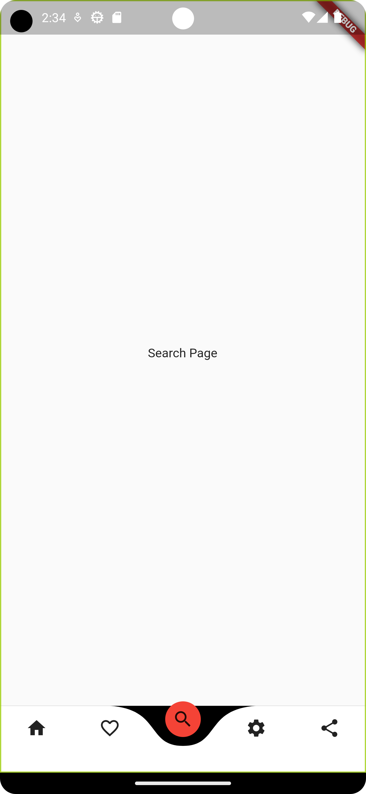

# curve_navigation_drawer

<p> Add dependency: </p>

```
dependencies:
  curved_navigation_bar: ^1.0.3 #latest version

```

<p> Easy to use: </p>

```
home: Scaffold(
        bottomNavigationBar: CurvedNavigationBar(
            items: const [
              Icon(Icons.home),
              Icon(Icons.favorite_border),
              Icon(Icons.search),
              Icon(Icons.settings),
              Icon(Icons.share),
            ]),

```

<p> Change page programmatically : </p>

```
class MyApp extends StatefulWidget {
  const MyApp({Key? key}) : super(key: key);

  @override
  State<MyApp> createState() => _MyAppState();
}

class _MyAppState extends State<MyApp> {

  var pageController = 0;

  final pages = const [
    HomePage(),
    FavoritePage(),
    SearchPage(),
    SettingPage(),
    SharePage(),

  ];

  @override
  Widget build(BuildContext context) {
    return MaterialApp(
      home: Scaffold(
        bottomNavigationBar: CurvedNavigationBar(
            index: 0,
            color: Colors.white,
            backgroundColor: Colors.black,
            buttonBackgroundColor: Colors.red,
            animationCurve: Curves.easeInOut,
            animationDuration: const Duration(milliseconds: 500),
            onTap: (index) {
              setState(() {
                pageController = index;
              });
            },
            items: const [
              Icon(Icons.home),
              Icon(Icons.favorite_border),
              Icon(Icons.search),
              Icon(Icons.settings),
              Icon(Icons.share),
            ]),
        body: pages[pageController],
      ),
    );
  }
}

```

<p>Output</p>


